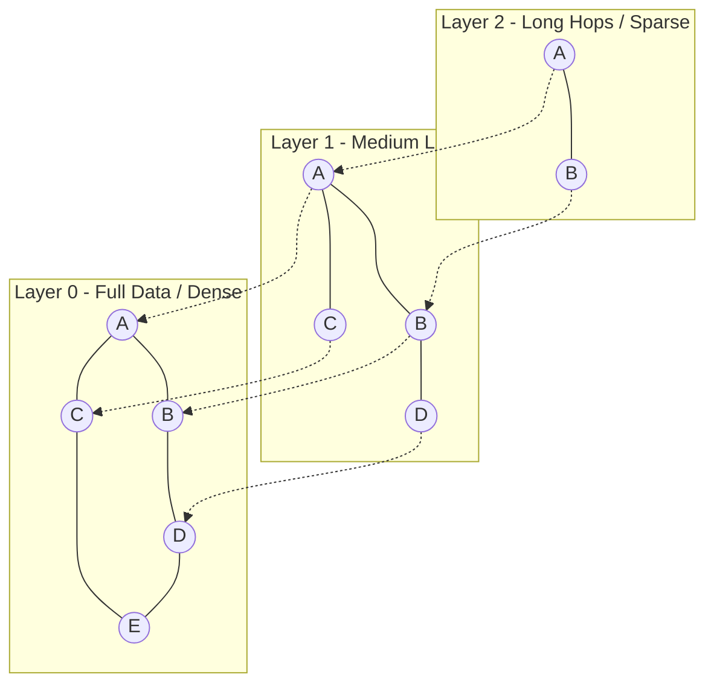

# Nano Vector DB

Lightweight in-memory vector database implemented from scratch in Python. This module provides efficient indexed storage for fast similarity search over high-dimensional vectors, using exact search (Flat) and approximate nearest neighbor (ANN) search via the HNSW (Hierarchical Navigable Small World) algorithm.

## Architecture and Technical Components

The database engine is based on two indexing and retrieval schemes:

### 1. Exact Search (Flat Index)
Performs a brute-force sequential search comparing the query vector against all vectors stored in the database.
*   **Complexity:** $O(N \cdot D)$, where $N$ is the total number of vectors and $D$ is the vector dimension.
*   **Advantage:** 100% accuracy and efficient native pre-filtering support on metadata.

### 2. Approximate Search (HNSW Index)
Implements the multilayer hierarchical graph algorithm for fast approximation. It structures the vectors into levels or layers:



*   **Upper Layers:** Sparse graphs with long links for fast, large-scale hops (exploration optimization).
*   **Lower Layer (Layer 0):** Contains the entirety of the vectors with dense, short-range links for local precision.
*   **Search Loop:** The algorithm starts exploring at the top layer looking for the local minimum (the node closest to the query), which is used as the entry point in the layer immediately below. This process repeats until reaching Layer 0, where a greedy search is performed maintaining a priority queue of size `efSearch` to return the best candidates.
*   **Complexity:** $O(\log N)$ for search and insertion, allowing scaling to millions of vectors.

Graph control hyperparameters:
*   `M`: Maximum number of bidirectional links per node at each layer.
*   `M0`: Maximum number of links per node at Layer 0 (fixed at $2 \cdot M$).
*   `efConstruction`: Number of candidate neighbors evaluated during insertion.
*   `efSearch`: Number of dynamic candidates evaluated during search.

## Distance Mathematical Foundations

The database supports three distance metrics, efficiently implemented via NumPy:

### Cosine Distance
Measures the angular difference between two vectors, ignoring their magnitude:

$$D_{\cos}(u, v) = 1.0 - \frac{u \cdot v}{\|u\|_2 \|v\|_2}$$

### $L_2$ (Euclidean) Distance
Measures the straight-line physical distance in multi-dimensional Cartesian space:

$$D_{L_2}(u, v) = \sqrt{\sum_{i=1}^{d} (u_i - v_i)^2}$$

### Inverted Dot Product
Suitable when vectors are already $L_2$ normalized, where the dot product is directly proportional to cosine similarity:

$$D_{\text{dot}}(u, v) = - (u \cdot v)$$

## Metadata Filtering and Smart Fallback

The module supports advanced relational metadata filters compatible with MongoDB syntax:
*   `$eq`: Strict value equality.
*   `$ne`: Value inequality or exclusion.
*   `$gt` / `$gte`: Greater than / Greater than or equal to for numeric fields.
*   `$lt` / `$lte`: Less than / Less than or equal to.
*   `$in`: Membership in a list of valid elements.
*   `$nin`: Non-membership in a list of elements.

**Fallback Mechanism:** If a filter is extremely restrictive (for example, it matches less than 5% of the DB) and the HNSW search fails to fill the `top_k` results quota due to graph pruning, the engine automatically falls back to exact `Flat` search with pre-filtering over the data to ensure the return of the nearest existing neighbors.

## Serialization Specification (Persistence)

The complete database state is saved to a serialized binary file that stores:
*   The flat dictionary of indexed vectors.
*   The dictionary of metadata associated by ID.
*   The adjacency lists and structural variables of the HNSW graph (multilayer connections and entry points).

## Installation Requirements

*   Python 3.10 or higher
*   NumPy

To install the specified dependencies, run:
```bash
pip install -r requirements.txt
```

## Execution and Verification Guide

### 1. Run Automated Tests
Verifies distance calculations, filters, and HNSW graph recall:
```bash
python3 -m unittest test_db.py
```

### 2. Run Demo
```bash
python3 example.py
```

## Connectivity within the ai-core-infra Ecosystem

This project leverages the output of other modules:
*   **contrastive-embedding-trainer:** Automatically loads the fine-tuned weights of the local siamese network to generate real semantic embeddings over text instead of relying on deterministic hash simulations.
*   **hybrid-search-retrieval-pipeline:** Provides the RAG's dense infrastructure, unifying its queries with those of the BM25 retriever.
*   **nexus-second-brain:** Acts as the production vector database for the final SPA to store segmented notes.
