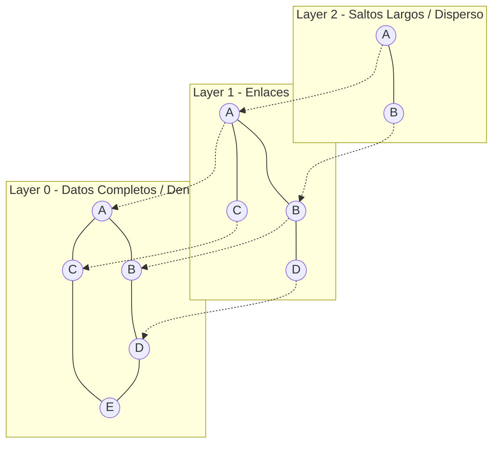

# Nano Vector DB

Base de datos vectorial ligera en memoria implementada desde cero en Python. Este modulo proporciona almacenamiento indexado eficiente para busquedas rapidas de similitud de vectores de alta dimension utilizando busqueda exacta (Flat) y busqueda aproximada de vecinos mas cercanos (ANN) mediante el algoritmo HNSW (Hierarchical Navigable Small World).

## Arquitectura y Componentes Tecnicos

El motor de la base de datos se basa en dos esquemas de indexacion y recuperacion:

### 1. Busqueda Exacta (Flat Index)
Realiza una busqueda secuencial por fuerza bruta comparando el vector consulta con todos los vectores registrados en la base de datos.
*   **Complejidad:** $O(N \cdot D)$, donde $N$ es el numero total de vectores y $D$ es la dimension vectorial.
*   **Ventaja:** Exactitud del 100% y soporte de pre-filtrado nativo eficiente sobre metadatos.

### 2. Busqueda Aproximada (HNSW Index)
Implementa el algoritmo de grafos jerarquicos multicapa para aproximacion rapida. Estructura los vectores en niveles o capas:



*   **Capas Superiores:** Grafos dispersos con enlaces largos para saltos rapidos de gran escala (optimizacion de exploracion).
*   **Capa Inferior (Capa 0):** Contiene la totalidad de los vectores con enlaces densos y de corto alcance para precision local.
*   **Bucle de Busqueda:** El algoritmo inicia la exploracion en la capa superior buscando el minimo local (nodo mas cercano al query), el cual se utiliza como punto de entrada (entrypoint) en la capa inmediata inferior. Este proceso se repite hasta llegar a la Capa 0, donde se realiza una busqueda codiciosa manteniendo una cola de prioridad de tamano `efSearch` para retornar los mejores candidatos.
*   **Complejidad:** $O(\log N)$ para busqueda e insercion, lo que permite escalar a millones de vectores.

Hiperparametros de control del grafo:
*   `M`: Cantidad maxima de enlaces bidireccionales por nodo en cada capa.
*   `M0`: Cantidad maxima de enlaces por nodo en la Capa 0 (fijado en $2 \cdot M$).
*   `efConstruction`: Numero de vecinos candidatos evaluados durante la insercion.
*   `efSearch`: Numero de candidatos dinamicos evaluados en la busqueda.

## Fundamentos Matematicos de Distancia

La base de datos admite tres metricas de distancia implementadas eficientemente mediante NumPy:

### Distancia de Coseno
Mide la diferencia angular entre dos vectores, ignorando su magnitud:

$$D_{\cos}(u, v) = 1.0 - \frac{u \cdot v}{\|u\|_2 \|v\|_2}$$

### Distancia $L_2$ (Euclidea)
Mide la distancia fisica en linea recta en el espacio cartesiano multi-dimensional:

$$D_{L_2}(u, v) = \sqrt{\sum_{i=1}^{d} (u_i - v_i)^2}$$

### Producto Escalar Invertido
Adecuado si los vectores ya estan normalizados $L_2$, donde el producto escalar es directamente proporcional a la similitud de coseno:

$$D_{\text{dot}}(u, v) = - (u \cdot v)$$

## Filtrado de Metadatos y Fallback Inteligente

El modulo admite filtros relacionales avanzados de metadatos compatibles con la sintaxis de MongoDB:
*   `$eq`: Igualdad estricta de valores.
*   `$ne`: Desigualdad o exclusion de valores.
*   `$gt` / `$gte`: Mayor que / Mayor o igual que para campos numericos.
*   `$lt` / `$lte`: Menor que / Menor o igual que.
*   `$in`: Pertenencia a una lista de elementos validos.
*   `$nin`: No pertenencia a una lista de elementos.

**Mecanismo de Fallback:** Si un filtro es extremadamente restrictivo (por ejemplo, coincide con menos del 5% de la BD) y la busqueda HNSW no consigue llenar el cupo de resultados `top_k` debido a la poda del grafo, el motor realiza un fallback automatico a la busqueda exacta `Flat` con pre-filtrado sobre los datos para asegurar el retorno de los vecinos mas cercanos existentes.

## Especificacion de Serializacion (Persistencia)

El estado completo de la base de datos se guarda en un archivo binario serializado que almacena:
*   El diccionario plano de vectores indexados.
*   El diccionario de metadatos asociados por ID.
*   Las listas de adjacencia y variables estructurales del grafo HNSW (conexiones multicapa y puntos de entrada).

## Requisitos de Instalacion

*   Python 3.10 o superior
*   NumPy

Para instalar las dependencias especificadas, ejecute:
```bash
pip install -r requirements.txt
```

## Guia de Ejecucion y Verificacion

### 1. Ejecutar Pruebas Automatizadas
Verifica calculos de distancias, filtros y recall del grafo HNSW:
```bash
python3 -m unittest test_db.py
```

### 2. Ejecutar Demostración
```bash
python3 example.py
```

## Conectividad en el Ecosistema ai-core-infra

Este proyecto aprovecha la salida de otros modulos:
*   **contrastive-embedding-trainer:** Carga automaticamente los pesos ajustados de la red siamesa local para generar embeddings semanticos reales sobre textos en lugar de depender de simulaciones deterministicas de hash.
*   **hybrid-search-retrieval-pipeline:** Proporciona la infraestructura densa del RAG, unificando sus consultas con las del recuperador BM25.
*   **nexus-second-brain:** Actua como la base de datos vectorial de produccion de la SPA final para almacenar notas segmentadas.
